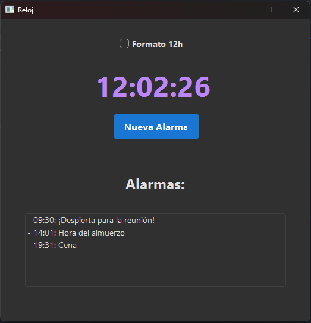
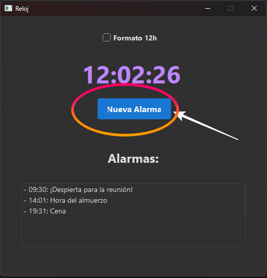
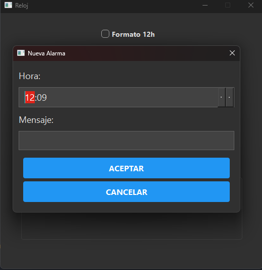
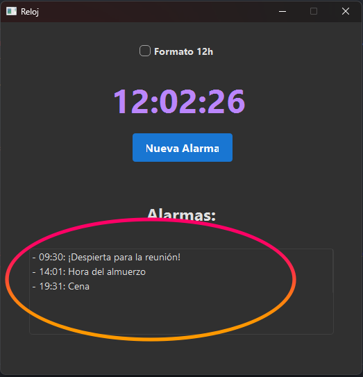
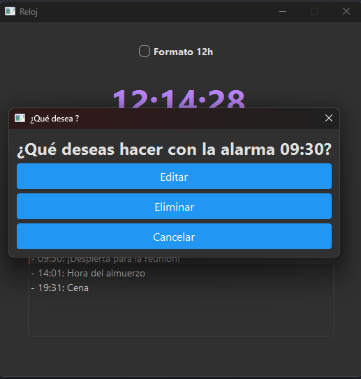
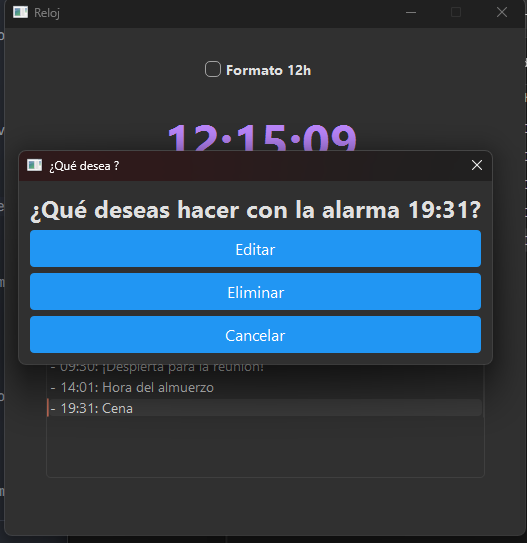

# DI06_Alarma - Aplicación de Reloj Alarma Simple en Python con PySide6



Este proyecto es una aplicación de reloj alarma sencilla desarrollada en Python utilizando la biblioteca PySide6 para la interfaz gráfica de usuario (GUI).  La aplicación permite a los usuarios configurar alarmas, visualizar la hora actual y gestionar sus alarmas de manera intuitiva.

## Características Principales

*   **Visualización de la hora actual:** Muestra la hora actual en tiempo real con opción de formato de 12 o 24 horas.
*   **Configuración de alarmas:** Permite a los usuarios crear nuevas alarmas especificando la hora y un mensaje personalizado para cada alarma.
*   **Listado de alarmas configuradas:** Muestra una lista clara de todas las alarmas programadas, facilitando su gestión.
*   **Edición y eliminación de alarmas:**  Los usuarios pueden modificar la hora o el mensaje de las alarmas existentes, así como eliminarlas si ya no son necesarias.
*   **Interfaz gráfica intuitiva:**  Desarrollada con PySide6, ofrece una interfaz de usuario gráfica simple y fácil de usar.

## Tecnologías Utilizadas

*   **Python:** Lenguaje de programación principal.
*   **PySide6:** Biblioteca de Python para la creación de interfaces gráficas de usuario,  el binding oficial de Qt para Python.

## Instalación y Ejecución

Para ejecutar esta aplicación, necesitas tener Python instalado en tu sistema y la biblioteca PySide6.  Sigue estos pasos:

**Prerrequisitos:**

1.  **Python:** Asegúrate de tener Python instalado. Puedes descargarlo desde [python.org](https://www.python.org/downloads/).  Se recomienda usar Python 3.6 o superior.
2.  **PySide6:** Instala PySide6 utilizando `pip`. Abre una terminal o línea de comandos y ejecuta:

    ```bash
    pip install PySide6
    ```

**Ejecución de la aplicación:**

1.  **Clona este repositorio:** Si aún no lo has hecho, clona este repositorio de GitHub a tu máquina local usando:

    ```bash
    git clone [https://github.com/alvarowau/DI06_Alarma.git](https://www.google.com/search?q=https://github.com/alvarowau/DI06_Alarma.git)
    cd DI06_Alarma
    ```

2.  **Ejecuta la aplicación:** Navega hasta el directorio del proyecto y ejecuta el archivo principal `main.py` con Python:

    ```bash
    python main.py
    ```

    Esto debería iniciar la aplicación del reloj alarma.

## Uso
## Uso

Esta sección te guiará a través de las funcionalidades principales de la aplicación Reloj Alarma.

### Crear una Nueva Alarma

1.  **Haz clic en el botón "Nueva Alarma".** Este botón, etiquetado como "Nueva Alarma", se encuentra en la parte superior de la ventana principal, justo debajo del reloj digital.

    

2.  **Se abrirá el diálogo "Nueva Alarma".** En este diálogo, podrás configurar los detalles de tu nueva alarma.

    

3.  **Selecciona la hora de la alarma.** Utiliza el control de "Hora" (QTimeEdit) para elegir la hora a la que deseas que suene la alarma. Puedes usar las flechas arriba y abajo para ajustar las horas y minutos, o escribir directamente la hora.

4.  **Escribe un mensaje para la alarma (opcional).** En el campo de texto "Mensaje", puedes escribir un mensaje personalizado que se mostrará cuando la alarma se active.  Este mensaje te ayudará a recordar el propósito de la alarma.

5.  **Haz clic en "Aceptar" para guardar la alarma.**  Una vez que hayas configurado la hora y el mensaje (opcional), haz clic en el botón "Aceptar" para guardar la nueva alarma. La alarma se añadirá a la lista de alarmas configuradas.

### Editar Alarma

1.  **Haz doble clic en la alarma a editar".** Esto esta bajo el boton Nueva alarma, donde tenemos una lista con las alarmas definidas por defecto

    

2.  **Se abrirá el diálogo "¿Que desea hacer?".** En este diálogo, podrás elegir entre borrar, editar o cancelar

    

3.  **Edita la alarma** Utiliza el control de "Hora" (QTimeEdit) para elegir la hora a la que deseas que suene la alarma. Puedes usar las flechas arriba y abajo para ajustar las horas y minutos, o escribir directamente la hora y configurar el mensaje.

5.  **Haz clic en "Aceptar" para guardar la alarma.**  Una vez que hayas configurado la hora y el mensaje (opcional), haz clic en el botón "Aceptar" para guardar la nueva alarma. La alarma se añadirá a la lista de alarmas configuradas.

### Eliminar Alarma


1.  **Haz doble clic en la alarma a editar".** Esto esta bajo el boton Nueva alarma, donde tenemos una lista con las alarmas definidas por defecto

    

2.  **Se abrirá el diálogo "¿Que desea hacer?".** En este diálogo, podrás elegir entre borrar, editar o cancelar

    

3.  **si presiona en eliminar** si presiona en eliminar, la alarma directamente se eliminara de la lista y no sonara

    

    


## Organización del Código

El código del proyecto está organizado en varios archivos para mejorar la mantenibilidad y la claridad:

*   **`main.py`:**  Punto de entrada principal de la aplicación. Inicializa y ejecuta la interfaz gráfica.
*   **`PanelMain.py`:** Contiene la lógica principal de la aplicación, incluyendo la gestión de alarmas, la actualización del reloj y la interacción con la interfaz de usuario.
*   **`vistas/ui_panel_main.py`:**  Archivo generado por Qt Designer que define la interfaz de usuario principal del panel principal (la vista principal de la alarma).  **No se debe modificar directamente, se recomienda usar Qt Designer para cambios en la interfaz.**
*   **`util/ventanas.py`:**  Contiene funciones para crear los diálogos de "Nueva Alarma" y "Editar Alarma".  Separa la creación de ventanas de la lógica principal.
*   **`util/estilos.py`:** Define estilos CSS para la aplicación, permitiendo una apariencia consistente y facilitando la modificación del estilo visual.
*   **`util/mensajes.py`:** Contiene funciones para mostrar mensajes en la aplicación, como el mensaje de alarma, promoviendo la reutilización de componentes de la interfaz de usuario.

Esta organización busca separar la lógica de la aplicación de la presentación (UI) y los estilos, facilitando la comprensión, el mantenimiento y la extensión del código.

## Contribución

¡Las contribuciones son bienvenidas! Si deseas contribuir a este proyecto, puedes seguir estos pasos:

1.  Haz un "Fork" del repositorio.
2.  Crea una rama con tu característica (`git checkout -b mi-nueva-caracteristica`).
3.  Realiza los cambios y haz "Commit" de tus contribuciones (`git commit -am 'Añade una nueva característica'`).
4.  Sube a la rama (`git push origin mi-nueva-caracteristica`).
5.  Abre un "Pull Request".

